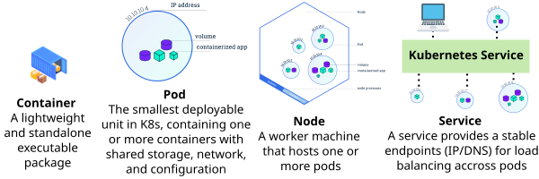

The following examples show how to use `kubectl` to manage resources on the Unified-AI platform.

We start with a brief introduction to Kubernetes (K8s) components, followed by common `kubectl` commands and practical examples of how to use them.


## Kubernetes components

Kubernetes (K8s) is made up of several components, such as namespaces, the control plane, and ingress.
This document focuses on the core building blocks: **containers, Pods, Nodes, and Services**.
These are briefly explained below and shown in the figure.

* **Service**: A service provides a stable network endpoint (IP address or DNS name). Services allow Pods to communicate with each other and can also expose applications to external users.
* **Node**: A physical or virtual machine that runs containerised applications. Each Node hosts one or more Pods.
* **Pod**: The smallest unit that can be deployed in Kubernetes. A Pod contains one or more containers that share storage, networking, and other resources.
* **Container**: A lightweight and standalone executable package.



See further details in the reference section.

## kubectl pods

Pods are the smallest deployable units in Kubernetes. They usually contain one main container (and sometimes sidecars) that run your application.

**List Pods.**
```bash
kubectl get pods
```

Example output:
```
NAME                    READY   STATUS             RESTARTS   AGE
mx-notebook-06-0        2/2     Running            0          4d10h
f83d03fca881            0/1     ImagePullBackOff   0          2d22h
```

**Describe a Pod.**

This command provides detailed information about a specific Pod.
Use kubectl describe pod when a Pod is not behaving as expected.
```bash
kubectl describe pod mx-notebook-06-0
```

Key sections to look at:

* **Name / Namespace**: Identifies the Pod and where it runs.
* **Node**: The node where the Pod is scheduled.
* **Status**: Overall Pod state (for example, Running).
* **IP**: Internal cluster IP assigned to the Pod.
* **Controlled By**: The controller managing the Pod (for example, a StatefulSet).
* **Containers**: Details about each container, including image, resources, and runtime status.
* **Conditions**: Indicates whether the Pod is ready, scheduled, and fully initialised.
* **Node-Selectors / Tolerations**: Scheduling constraints that affect where the Pod can run.
* **Events**: Useful for debugging; shows recent issues such as image pull failures or scheduling problems.

## kubectl jobs

Jobs are used to run batch or one-off tasks, such as training jobs or data processing.

**List Jobs**
```bash
kubectl get jobs
```

Example output:
```bash
NAME                  STATUS      COMPLETIONS   DURATION   AGE
e55d07facbf4-node-0   Suspended   0/4                      2d21h
f83d03fca881-node-0   Running     0/1           11d        11d
```

**Describe a Job.**

```bash
kubectl describe job f83d03fca881-node-0
```

This command gives detailed information about how the Job is configured and how it is progressing.
Use this command to understand why a Job is running slowly, failing, or stuck.

Important fields include:

* **Parallelism / Completions**: How many Pods run in parallel and how many must complete.
* **Suspend**: Whether the Job is paused.
* **Pods Statuses**: Number of active, succeeded, and failed Pods.
* **Pod Template**: The Pod specification used by the Job, including:
    * Container image
    * Command and arguments
    * Resource requests and limits
    * Environment variables
* **Node-Selectors**: Constraints that control which nodes the Job can run on.
* **Events**: Helpful for troubleshooting Job failures.

## kubectl Filtering and Querying

Kubernetes outputs a lot of information. Filtering helps you extract only what you need.

We provide a Pod Information Script, [`pod-info.sh`](https://github.com/ucl-arc-environments/kubeflow-trainer-examples/blob/main/bash_scrips/pod-info.sh), which simplifies common kubectl queries.

**Using the Pod Information Script**

* View the help menu:
```bash
bash kpodinfo.sh --help
```

* Help output:
```text
Pod Information Script - Simplified kubectl queries

Usage: kpodinfo.sh [OPTIONS] COMMAND

Options:
  -h, --help                  Show this help message

Commands:
  cpu-requests                Show pod names with CPU requests
  memory-requests             Show pod names with CPU and memory requests
  quota-summary               Show Quota Summary
  flavors                     Show Flavors Reservation and Usage
  all-info                    Show detailed pod information

Examples:
  kpodinfo.sh cpu-requests
  kpodinfo.sh memory-requests
```

**Example: Get detailed pod information for your namespace**

Run this [mnist](https://github.com/ucl-arc-environments/kubeflow-trainer-examples/blob/main/hello-world-mnist/mnist.ipynb) jupyter notebook and after the cell for checking job status directly, you can run `bash kpodinfo.sh all-info`

```bash
bash kpodinfo.sh all-info
```

Sample output
```text
=== All Pod Information ===

Basic Pod Status:
NAME                                               READY   STATUS    RESTARTS   AGE
checkpointed-training-workflow-01-0                2/2     Running   0          91s
ml-pipeline-ui-artifact-55894b5986-xnmmg           2/2     Running   0          10d
ml-pipeline-visualizationserver-847879f7bb-lgfjd   2/2     Running   0          11d

Pods with CPU Requests:
---------------------------------------------------------------------------------------------------
Pod Name                                          Container                          CPU (millicores)
------------------------------------------------  ---------------------------------  ----------------
checkpointed-training-workflow-01-0               checkpointed-training-workflow-01  2
ml-pipeline-ui-artifact-55894b5986-xnmmg          ml-pipeline-ui-artifact            10m
ml-pipeline-visualizationserver-847879f7bb-lgfjd  ml-pipeline-visualizationserver    50m

Pod Resource for Memory Requests:
--------------------------------------------------------------------------
Pod Name                                          CPU               Memory
------------------------------------------------  ----------------  ------
checkpointed-training-workflow-01-0               2                 4Gi
ml-pipeline-ui-artifact-55894b5986-xnmmg          10m               70Mi
ml-pipeline-visualizationserver-847879f7bb-lgfjd  50m               200Mi

Show quota summary:
-----------------------------------------------------------
GPU Quota: dev-shared
Pending: 1 | Admitted: 3
-----------------------------------------------------------
RESOURCE (Flavor: a100-80gb-nvlink) NOMINAL QUOTA
----------------------------------- ---------------
cpu                                 48
ephemeral-storage                   1000Gi
nvidia.com/gpu                      8
memory                              1000Gi
pods                                110

Show workloads with Flavors Reservation and Usage:
---------------------------------------------------------------------------------------
RESOURCE                  RESERVED (default)             USED (default)
------------------------  ------------------------------ ------------------------------
cpu                       2360m                          2360m
pods                      3                              3
ephemeral-storage         16860Mi                        16860Mi
nvidia.com/gpu            0                              0
memory                    4750Mi                         4750Mi
```


## References
* What is kubectl?: https://kubernetes.io/docs/reference/kubectl/
* The architectural concepts behind Kubernetes: https://kubernetes.io/docs/concepts/architecture/
