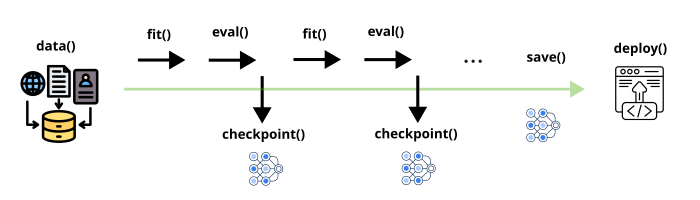

## Introduction
Saving intermediate checkpoints makes training more reliable.
Long training runs or work spread across several machines might be prone to fail.
Checkpoints allow PyTorch to restart from the last saved point instead of beginning again from scratch.

Checkpoints also help with generalisation.
Training loss may keep falling, but validation error can stop improving or even rise because of overfitting.
Saving checkpoints regularly lets you return to the model with the best validation results or stop training at the right time.

They also make training easier to adjust.
Models usually reach a good solution quickly and then improve slowly by focusing on edge cases.
When training again with new data, it is often better to restart from an earlier checkpoint so the model focuses on new information rather than older details.

Checkpoint size is important when planning training infrastructure.
It mainly depends on three things: the number of model parameters, the size of the compute cluster (world size), how training is distributed, such as model parallelism (MP) or data parallelism (DP).

## Checkpoint storage example for PyTorch DDP using Fashion MNIST Training

This function trains a convolutional neural network on the Fashion-MNIST dataset using PyTorch with optional distributed training. It sets up a distributed environment, builds a simple CNN model, and trains it over several epochs on a subset of the dataset. During training, checkpoints containing the model and optimiser state are saved at regular intervals using an atomic save method to ensure reliability on shared or Kubernetes storage. The function also supports resuming training from a saved checkpoint and ensures that only the main process handles dataset downloads and checkpoint writing.

See the example [mnist-checkpoints-fundamentals.ipynb](https://github.com/ucl-arc-environments/kubeflow-trainer-examples/blob/main/checkpoints-fundamentals/mnist-checkpoints-fundamentals.ipynb).

